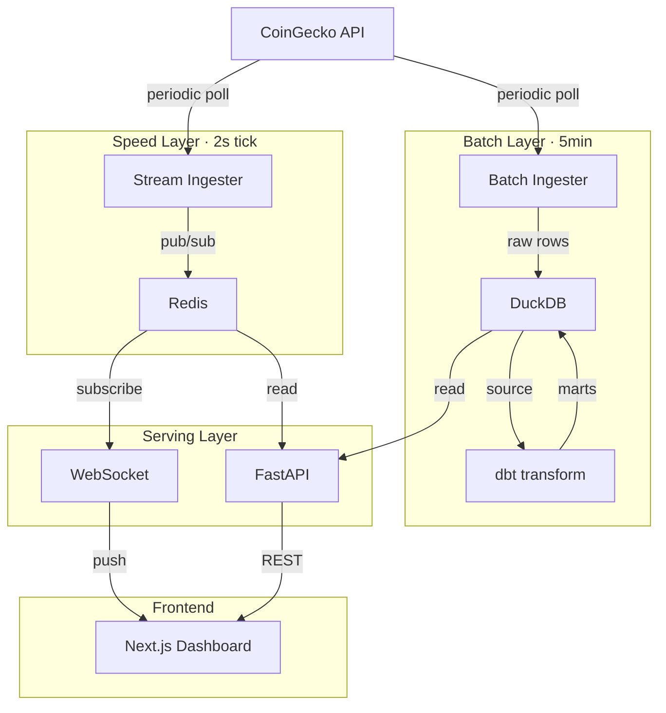

# Crypto Pipeline — Lambda Architecture Demo

An end-to-end data engineering portfolio project demonstrating the **Lambda Architecture** pattern: real-time streaming (speed layer), periodic batch processing with dbt transforms (batch layer), and a merged serving layer — all surfaced through a Next.js dashboard.



## Tech Stack

| Layer | Technology | Purpose |
|-------|-----------|---------|
| Speed | Python, Redis pub/sub | Real-time simulated prices with 120s TTL |
| Batch | Python, DuckDB, dbt, APScheduler | Periodic ingest → dbt build → star schema |
| Serving | FastAPI, redis.asyncio, WebSocket | Merge speed+batch views, pub/sub bridge |
| Frontend | Next.js 14, Recharts, Tailwind CSS | Live ticker, charts, pipeline health, logs |
| Infra | Docker Compose (5 services) | Redis, stream-ingest, batch-ingest, api, web |

## Quickstart

```bash
# Clone and start all services
make up

# Open the dashboard
open http://localhost:3000

# View architecture explainer
open http://localhost:3000/architecture
```

Wait ~10 seconds for the stream ingester to populate Redis. The batch ingester runs on startup and every 5 minutes thereafter.

## Project Structure

```
portfolio/
├── docker-compose.yml
├── Makefile
├── .gitignore
│
├── ingest/
│   ├── stream/main.py          # Speed layer — 2s tick, Redis pub/sub
│   └── batch/main.py           # Batch layer — 5min ingest + dbt build
│
├── dbt/
│   ├── dbt_project.yml
│   ├── profiles.yml
│   └── models/
│       ├── staging/             # stg_prices, stg_tickers
│       │   └── schema.yml       # source: main._raw_prices
│       └── marts/               # fct_price_snapshots, dim_ticker, dim_time
│           └── schema.yml       # not_null + unique tests
│
├── api/
│   ├── main.py                  # FastAPI app + lifespan
│   ├── db.py                    # DuckDB + Redis connectors
│   ├── websocket.py             # Redis pub/sub → WebSocket bridge
│   └── routes/
│       ├── prices.py            # GET /api/prices/* (speed|batch|merged)
│       └── pipeline.py          # GET /api/pipeline/status, logs, runs, triggers
│
└── web/
    ├── app/
    │   ├── page.tsx             # Dashboard
    │   └── architecture/page.tsx# Lambda Architecture explainer
    └── components/
        ├── LiveTickerBar.tsx    # Scrolling WebSocket ticker
        ├── PriceChart.tsx       # Recharts line chart
        ├── TickerTable.tsx      # Price table
        ├── PipelineHealth.tsx   # Dual-layer health cards
        ├── LogPanel.tsx         # Expandable pipeline logs
        ├── LayerToggle.tsx      # speed | batch | merged
        └── LambdaDiagram.tsx    # Interactive SVG diagram
```

## API Endpoints

| Method | Endpoint | Description |
|--------|----------|-------------|
| GET | `/api/prices/latest?view=speed` | Latest prices from Redis (real-time) |
| GET | `/api/prices/latest?view=batch` | Latest prices from DuckDB (historical) |
| GET | `/api/prices/latest?view=merged` | Merged view — speed overrides batch |
| GET | `/api/prices/{symbol}/history?hours=24` | Historical prices from DuckDB |
| GET | `/api/pipeline/status` | Dual-layer health, dbt test results, row counts |
| GET | `/api/pipeline/logs?layer=all` | Unified logs from Redis + DuckDB |
| GET | `/api/pipeline/runs` | Batch run history |
| GET | `/api/pipeline/architecture` | Layer metadata for the diagram |
| POST | `/api/pipeline/trigger/speed` | Manually trigger speed layer tick |
| POST | `/api/pipeline/trigger/batch` | Manually trigger batch ingest + dbt build |
| WS | `/ws/live` | Real-time price push from Redis pub/sub |

## How Each Layer Works

**Speed Layer** (`ingest/stream/main.py`)
- Generates 6 crypto tickers every 2 seconds with Brownian motion price drift
- Periodically fetches real CoinGecko data to anchor prices
- Writes to Redis with 120s TTL, publishes to `prices:live` channel
- Heartbeat logs every 60s to `pipeline:logs:speed`
- Supports manual trigger via `pipeline:trigger:speed` pub/sub channel

**Batch Layer** (`ingest/batch/main.py`)
- APScheduler triggers every 5 minutes (plus on startup)
- Ingests 6 tickers into DuckDB `_raw_prices` table
- Runs `dbt build` — transforms raw data through staging models into a star schema (fct_price_snapshots, dim_ticker, dim_time)
- dbt tests validate: not_null, unique constraints
- Dual-logs every phase to Redis lists + DuckDB `pipeline_log` table
- Supports manual trigger via `pipeline:trigger:batch` pub/sub channel

**Serving Layer** (`api/`)
- FastAPI queries Redis for speed data, DuckDB for batch data
- Merged view: batch history with speed layer overriding recent data
- WebSocket bridge connects Redis pub/sub to browser clients
- Manual trigger endpoints let users initiate pipeline runs from the dashboard

**Dashboard** (`web/`)
- Live scrolling ticker bar via WebSocket
- Price charts with layer toggle (speed vs batch vs merged)
- Pipeline health cards showing both layers with manual trigger buttons
- Expandable log panel with speed/batch/all filter
- Architecture page with interactive Lambda diagram

## Makefile Commands

```bash
make up           # Build and start all services
make down         # Stop all services
make build        # Rebuild images
make logs         # Tail all service logs
make seed         # Trigger a manual batch run
make dbt-test     # Run dbt tests only
make dbt-build    # Run dbt build only
make clean        # Stop and remove volumes + data
```

## Demo Moments

1. **Layer comparison** — Toggle speed/batch/merged on the chart. Speed shows real-time noise, batch shows smoothed historical data.
2. **Manual triggers** — Click "Trigger Now" on either pipeline health card to force an immediate ingest.
3. **Pipeline monitoring** — Watch dbt test results appear in the log panel after each batch run.
4. **Fault tolerance** — Kill `stream-ingest` container: speed health goes stale, batch continues serving.
5. **Architecture education** — `/architecture` page explains each Lambda layer with live metadata from the API.

## CV Bullet Points

- Designed and built an **end-to-end Lambda Architecture** pipeline processing real-time cryptocurrency data across 5 containerized services
- Implemented **speed layer** with Redis pub/sub achieving sub-second latency for live price streaming
- Built **batch layer** with DuckDB and dbt, transforming raw data into a **star schema dimensional model** with automated data quality tests
- Developed **merged serving layer** in FastAPI combining real-time and historical views, with WebSocket bridge for live browser updates
- Created an interactive **Next.js dashboard** with live tickers, comparative charts, pipeline health monitoring, and manual trigger controls
- Orchestrated all services with **Docker Compose** using pub/sub channels for inter-service communication
